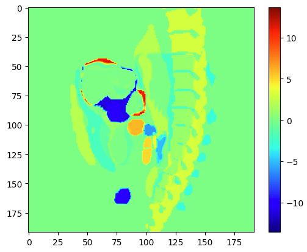

# convexAdam
Original code and documentation available at: https://github.com/multimodallearning/convexAdam

## AMS izziv - Final report
### Adis Skrijelj
---

# Method explanation

The choice of model depends on your input data:
- **UNet Model:** Use this for segmented images (label maps or masks).
- **MIND Model:** Use this for raw CT/MR images that include keypoints.

Both methods aim to compute a **displacement field**, aligning the moving image to the fixed image. They involve two optimization steps:
1. **Convex Optimization:** Performs coarse alignment and computes an initial displacement field.
2. **Adam Optimization:** Refines the initial displacement field for finer details.

During the optimization process, metrics like **Dice Coefficient**, **HD95**, **TRE**, and **Jacobian Determinant** are calculated and saved.

---

## **UNet Model**
The UNet-based optimization accepts **segmented images** (e.g., masks or label maps) as input.

### **Key Steps:**
1. **Feature Extraction:**
   - Features from the fixed and moving images are extracted and passed through a **correlation layer**, which calculates the similarity between voxels using the **Sum of Squared Differences (SSD)**.

2. **Convex Optimization (Coarse Alignment):**
   - Randomly generates parameters:
     - `grid_sp`: Downsampling factor for image grids.
     - `disp_hw`: Maximum voxel displacement during registration.
   - Produces an initial displacement field.

3. **Adam Optimization (Fine-Tuning):**
   - Refines the coarse displacement field using the Adam optimizer.
   - Includes **smoothness regularization** to enforce a smooth displacement field.

4. **Output:**
   - Optimized parameters.
   - Final displacement field.

### **Metrics:**
- **Dice Coefficient:** Measures overlap accuracy between fixed and warped segmentations.
- **HD95:** 95th percentile of Hausdorff Distance, evaluating worst-case alignment errors.
- **Jacobian Determinant:** Assesses deformation smoothness and checks for foldings.

---

## **MIND Model**
The **MIND (Modality Independent Neighborhood Descriptor)** model is designed for multi-modal image registration, particularly effective with keypoint-based or raw CT/MR images. MIND computes robust local intensity patterns rather than relying on absolute intensity values.

### **Key Steps:**
1. **Feature Extraction:**
   - Computes **MIND descriptors** for fixed and moving images. These descriptors encode local neighborhood intensity patterns.

2. **Convex Optimization (Coarse Alignment):**
   - Randomly generates parameters:
     - `grid_sp`: Downsampling factor for image grids.
     - `disp_hw`: Maximum voxel displacement during registration.
     - `mind_r`: Radius for MIND descriptor computation.
     - `mind_d`: Distance between voxel pairs in MIND descriptors.
   - Aligns images coarsely by correlating MIND descriptors.

3. **Adam Optimization (Fine-Tuning):**
   - Refines the coarse displacement field using the Adam optimizer.
   - Enforces smoothness using **Gaussian** or **Spline-based regularization**.

4. **Output:**
   - Optimized parameters.
   - Final displacement field.

### **Metrics:**
- **TRE (Target Registration Error):** Measures alignment accuracy at specific landmarks or keypoints.
- **Jacobian Determinant:** Ensures smooth and invertible deformations.

---

## **Key Differences Between UNet and MIND Models**
- **Input Type:**
  - **UNet**: Segmented images (masks or label maps).
  - **MIND**: Raw images or images with keypoints.
- **Metrics:**
  - **UNet**: Dice, HD95, and Jacobian determinant.
  - **MIND**: TRE and Jacobian determinant.
- **Optimization Parameters:**
  - **UNet**: Focuses on segmentation accuracy (e.g., Dice).
  - **MIND**: Uses MIND-specific parameters like `mind_r` and `mind_d` to handle raw data.

Both methods ultimately compute a **displacement field**, enabling image registration across a wide variety of scenarios.

---

# Image Registration Model: Usage Guide

This README provides a step-by-step guide to using convexAdam. The models support both U-Net and MIND-based approaches for image alignment.

---

## **Getting Started**

## Project Structure
Make sure to include any missing data/folders that are specified bellow.

```plaintext
Project/
├── Data/
│   ├── AMS_Images/
│       ├── ThoraxCBCT_OncoRegRelease_06_12_23/
│           ├── Release_06_12_23/
│               ├── imagesTr/
│               ├── keypoints01Tr/
│               ├── keypoints02Tr/
│               ├── labelsTr/
│               ├── landmarks01Tr/
│               ├── landmarks02Tr/
│               ├── masksTr/
│               ├── info.txt
│               ├── ThoraxCBCT_dataset.json
|               ├── configfiles.json
├── Results/
│   ├── DisplacementFieldMIND/
│   ├── DisplacementFieldUNet/
│   ├── MIND/
│   ├── UNet/
│   ├── WarpedImages/
├── self_configuring/
│   ├── convex_run_withconfig.py
│   ├── adam_run_withconfig_shiftSpline.py
│   ├── convex_run_paired_mind.py
│   ├── adam_run_paired_mind_shiftSpline.py
│   ├── main_for_l2r3_MIND_testset.py
│   ├── infer_convexadam.py
│   ├── helper_functions.py
├── cli.py
├── Dockerfile
├── requirements.txt
├── README.md
```

### **1. Environment Setup**

The project is built using Docker. Use the provided Dockerfile to create a Docker image and run the application.

#### **Steps:**
1. Build the Docker image:
   ```bash
   docker build -t convexadam .
   ```

2. Run the Docker container:
    ```bash
    docker run --gpus all -it --rm -v your_path/AMS_Challenge/:/app/ convexadam
    ```

### **2. The CLI tool**
Once the container is running, use the CLI tool to interact with the models. The CLI provides commands for running convex and Adam optimization, generating displacement fields, and applying them to images.

You can run help command and all available commands will be displayed

When you run the command the program will ask you for some extra parameters.

### **3. Configuration Files**
It is important to include configuration files in the correct path. I have already provided some exaamples of it and you can run the code as it is.

1. UNet uses same config file for convex and adam optimization. It is provided at /Data/AMS_Images/ThoraxCBCT_OncoRegRelease_06_12_23/Release_06_12_23/convex_config_unet.json
Config file explained:
topk - Specifies which images (or patients) to use from the dataset. For example, if topk = [0000, 0001, 0002], it will process images that have this numbers included in their name. Example: img_0000.ni.gz
HWD - A list representing the dimensions of the input images
num_labels - The number of segmentation labels or anatomical regions in the dataset
topk_pair - Determines which pairs of images from topk should be aligned

2. MIND convex and adam optimization config file
Only difference is that you have to input path to keypoints.

3. UNet Displacement field config file
Example available at Data/AMS_Images/ThoraxCBCT_OncoRegRelease_06_12_23/Release_06_12_23/ConfigDisplacementFieldUNet.json
Make sure to include yours in the same path

### **4 Example workflow**
1. Run convex optimization (UNet)
    ```bash
    convex_run_Unet
    Enter GPU ID: 0
    ```
    Scores will be saved in Results/UNet/optimized_params.pt
    Function will also return index of best configuration make sure to use it in next step (convex_s)

2. Run Adam Optimization (UNet)
    ```bash
    adam_run_Unet
    Enter GPU ID: 0
    Enter convex_s: 77 (used in my example)
    ```
    Scores will be saved in Results/UNet/optimized_params_adam.pt and Results/UNet/jac_params.pt

3. Get displacement field
    ```bash
    get_displacement_field_Unet
    Enter GPU ID: 0
    Enter convex_s: 77
    adam_s1 = 2
    adam_s2 = 15
    ```
    Displacement fields will be saved at Results/DisplacementFieldUNet/

4. Apply displacement field:
    ```bash
    path_to_fixed_image
    path_to_moving_image
    path_to_displacement_field
    ```
    Warped image will be saved at Results/WarpedImages/

Same workflow applies for MIND model. The parameters that i used for it are:
mind_r = 3
mind_d = 3
grid_sp = 3
disp_hw = 5
nn_mult = 5
grid_sp_adam = 3
lambda_weight = 1
selected_niter = 150
selected_smooth = 5

### **5 Output Metrics**
Output metrics will be calculated during convex and adam optimization and will be saved in the Results folder
1. UNet
Dice Coefficient: Overlap accuracy between registered images.
HD95: Hausdorff Distance at 95th percentile for boundaries.
Jacobian Determinant (jstd): Measures smoothness of deformation.

2. MIND
TRE: Target Registration Error between keypoints.
Jacobian Determinant (jstd): Measures smoothness of deformation.

# Results
This document outlines the results of testing two different image registration models: 

1. **Model 1: U-Net based Registration**
2. **Model 2: MIND-based Registration**

The evaluation was performed on the **AMS Challenge** dataset and Grand Challenge dataset (CT images during inspiration and expiration).

The optimization was run on an NVIDIA GeForce RTX 3060 12GB. Some configurations were skipped due to memory constraints.

---

## **1. U-Net Based Registration**

### **Results on AMS Challenge Data**
- **Dice**: 0.7962
- **Dice30**: 0.6446
- **jstd**: 0.013
- **HD95**: 28.22

### **Results on Lung CT Images**
- **Dice**: 0.87
- **Dice30**: 0.87
- **jstd**: 0.0441
- **HD95**: 13.67

### **Commentary on U-Net Results**
- **Dice**: The Dice coefficient on AMS Challenge data indicates good overlap (0.7962), but the performance is significantly better on the lung CT images (0.87), probably because lung CT images had just 2 labes while AMS CT images had 14.
- **jstd**: The Jacobian standard deviation (jstd) is very low for AMS Challenge data (0.013), highlighting smoother deformation fields. For Grand Challenge dataset, the jstd is slightly higher (0.0441).
- **HD95**: The Hausdorff Distance at 95th percentile (HD95) is high for AMS Challenge data (28.22), indicating boundary discrepancies. However, for Grand Challenge dataset, it is significantly lower (13.67), demonstrating better alignment.

---

## **2. MIND-Based Registration**

### Results obtained during optimization

### **Results on AMS Challenge Data**
- **TRE**: 3.924
- **jstd**: 0.0653

### **Commentary on MIND Results**
- **TRE**: The Target Registration Error (TRE) of 3.924 suggests moderate misalignment on AMS Challenge data. This indicates that the MIND-based model may not be as precise as the U-Net model for this dataset.
- **jstd**: A higher jstd (0.0653) compared to the U-Net model (0.013 for AMS data) suggests more variability in the deformation field, indicating that the MIND model produces more complex transformations.

---

## **Comparison Between U-Net and MIND Models**

- **Dice Coefficients**: The U-Net model significantly outperforms the MIND model in terms of Dice score, particularly on well-aligned custom CT images.
- **TRE and jstd**: While MIND shows reasonable TRE and jstd values on AMS Challenge data, the U-Net model demonstrates superior performance, particularly in producing smoother deformation fields.
- **HD95**: The U-Net model provides a much lower HD95 score on custom data, indicating better alignment with reduced boundary discrepancies.

In summary, the U-Net model delivers better performance for both AMS Challenge and custom data, particularly in terms of Dice, HD95, and overall alignment accuracy. However, MIND-based registration may still have applications in scenarios requiring more flexible deformation modeling.

---

## **Visualization**

1. **Before Registration**: The CT scans before alignment.
2. **After Registration**: The CT scans after applying the registration model.
3. **Difference Image**: A difference image highlighting misalignments.

**U-Net Model Results on CT expiration/inspiration**:


**U-Net Model Results on AMS Challenge Data**:




**MIND Model Results on AMS Challenge Data**:


---

### Results from provided code
```bash
case_results [0] [0011_0001<--0011_0000']:
        LogJacDetStd        : 0.05703
        num_foldings        : 0.00000
        TRE_kp              : 5.13669
        TRE_lm              : 4.95030
        DSC                 : 0.61423
        HD95                : 36.99551
case_results [1] [0012_0001<--0012_0000']:
        LogJacDetStd        : 0.08178
        num_foldings        : 0.00000
        TRE_kp              : 4.97068
        TRE_lm              : 4.23266
        DSC                 : 0.61908
        HD95                : 34.97424
case_results [2] [0013_0001<--0013_0000']:
        LogJacDetStd        : 0.04711
        num_foldings        : 0.00000
        TRE_kp              : 7.59544
        TRE_lm              : 3.88136
        DSC                 : 0.39952
        HD95                : 66.93747
case_results [3] [0011_0002<--0011_0000']:
        LogJacDetStd        : 0.08626
        num_foldings        : 0.00000
        TRE_kp              : 5.86606
        TRE_lm              : 5.09382
        DSC                 : 0.39045
        HD95                : 52.08100
case_results [4] [0012_0002<--0012_0000']:
        LogJacDetStd        : 0.06540
        num_foldings        : 0.00000
        TRE_kp              : 5.80599
        TRE_lm              : 5.81913
        DSC                 : 0.60830
        HD95                : 35.12312
case_results [5] [0013_0002<--0013_0000']:
        LogJacDetStd        : 0.05755
        num_foldings        : 0.00000
        TRE_kp              : 7.47627
        TRE_lm              : 3.64730
        DSC                 : 0.40928
        HD95                : 66.02607

 aggregated_results:
        LogJacDetStd        : 0.06586 +- 0.01396 | 30%: 0.07359
        TRE_kp              : 6.14186 +- 1.03798 | 30%: 6.67116
        TRE_lm              : 4.60410 +- 0.75407 | 30%: 5.02206
        DSC                 : 0.50681 +- 0.10724 | 30%: 0.40440
        HD95                : 48.68957 +- 13.86814 | 30%: 36.05931
```

## **Conclusion**

- **U-Net Model**: Outperforms MIND-based registration on both datasets. It is particularly effective on custom CT images during inspiration and expiration.
- **MIND Model**: Provides reasonable results on AMS Challenge data but shows higher TRE and jstd, indicating less precise deformation compared to U-Net.

Both models provide valuable insights into registration performance, with U-Net being the preferred choice for the given datasets.

**More examples are provided in DisplayImage.ipynb**

---